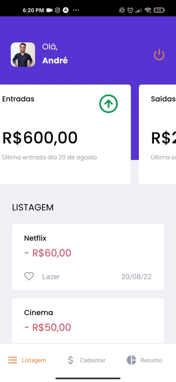
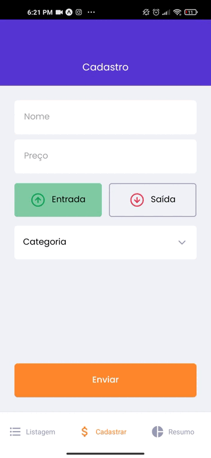
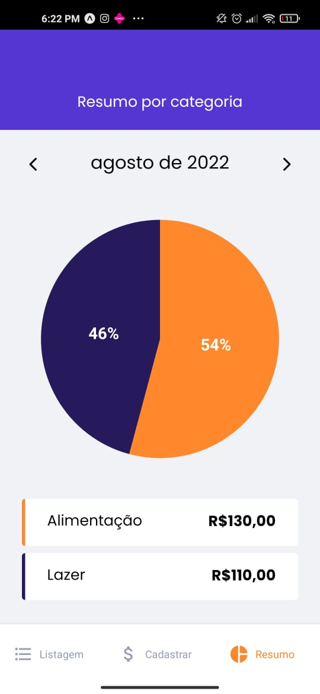

# Gofinance

<p align="center">
This is a personal finance application that seeks to help the user with their spending control and identify higher consumption categories
</p>

<h4 align="center"> 
	🚧  Gofinance under construction...  🚧
  <br/>
    The content of the application is in Portuguese
</h4>

## Screenshots

<div align="center">
    
    
    
</div>

### How to Install

Before starting, you will need to have the following tools installed on your machine:
[Git](https://git-scm.com), [Node.js](https://nodejs.org/en/), [Yarn](https://yarnpkg.com/).
Besides, it's good to have an editor to work with the code like [VSCode](https://code.visualstudio.com/)

### 🎲 Running the Application

```bash
# Clone this repository
$ git clone https://github.com/andre-ols/gofinance.git

# access the project folder in the terminal/cmd
$ cd gofinance

# Install the dependencies and start the server:

$ yarn install
$ yarn start

```

### How to use the Application 🚀

- To start the application, just type `yarn start` in the terminal/cmd.

- Then scan the QR Code app from the terminal using Expo go App to access the app.

### 🛠 Technologies Used

The following tools were used in building the project:

- [Node.js](https://nodejs.org/en/)
- [Yarn](https://yarnpkg.com/)
- [Git](https://git-scm.com/)
- [Expo](https://expo.io/)
- [React Native](https://reactnative.dev/)

### Author

<br />

[](https://www.linkedin.com/in/andr%C3%A9-oliveira-silva-3496a2106/)
[](mailto:contato.andreols@gmail.com)

## License

This project is under the license [MIT](./LICENSE).

<p>Made with ❤️ by <a href="https://www.linkedin.com/in/andr%C3%A9-oliveira-silva-3496a2106/">André Oliveira</a>!</p>
